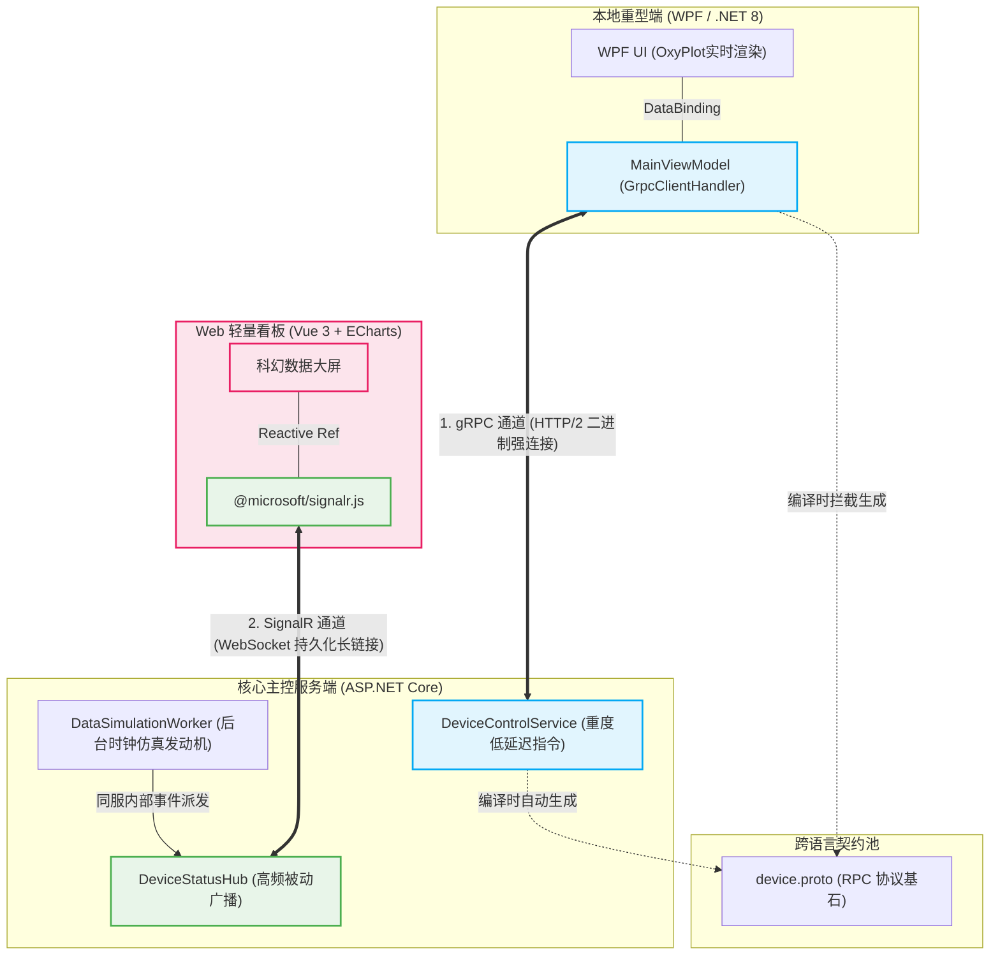
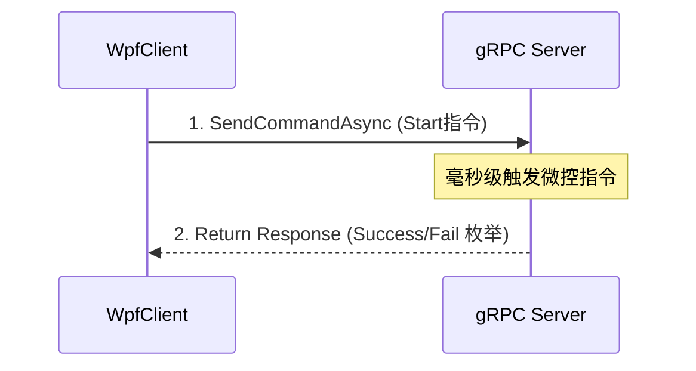
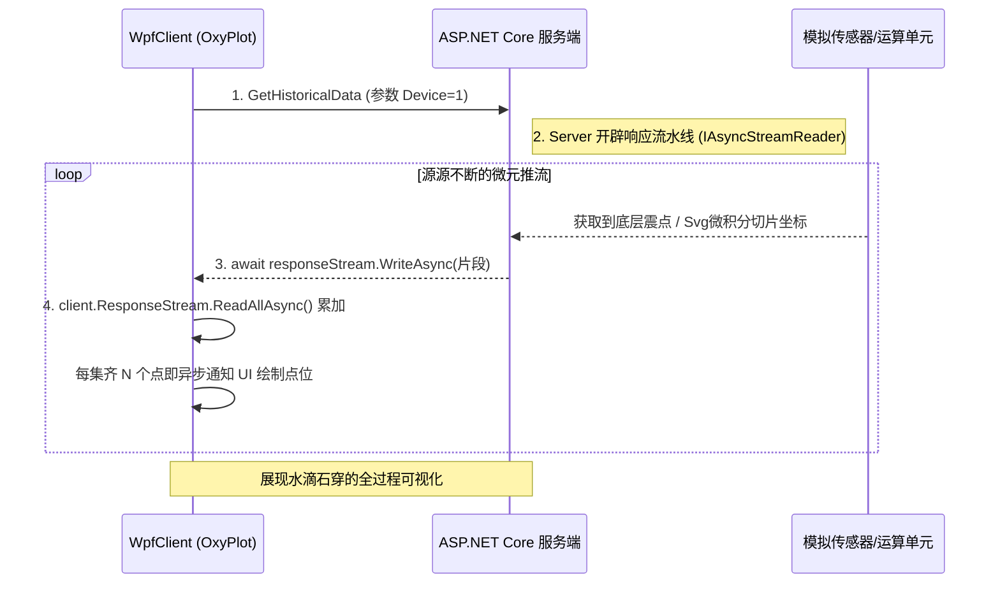
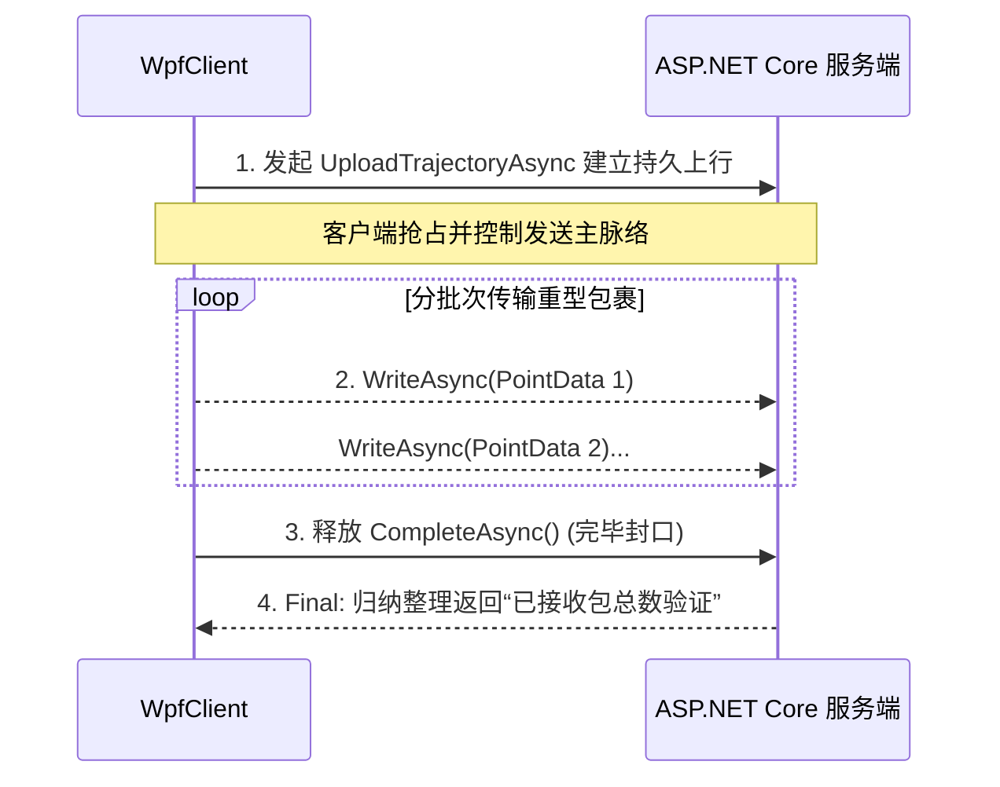
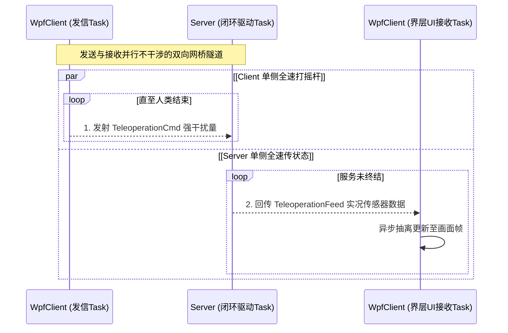
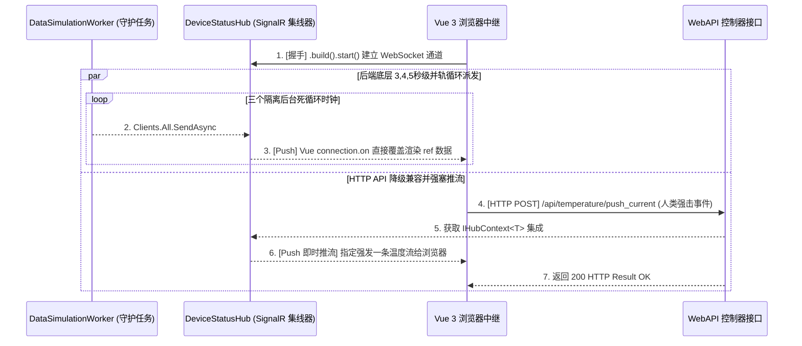
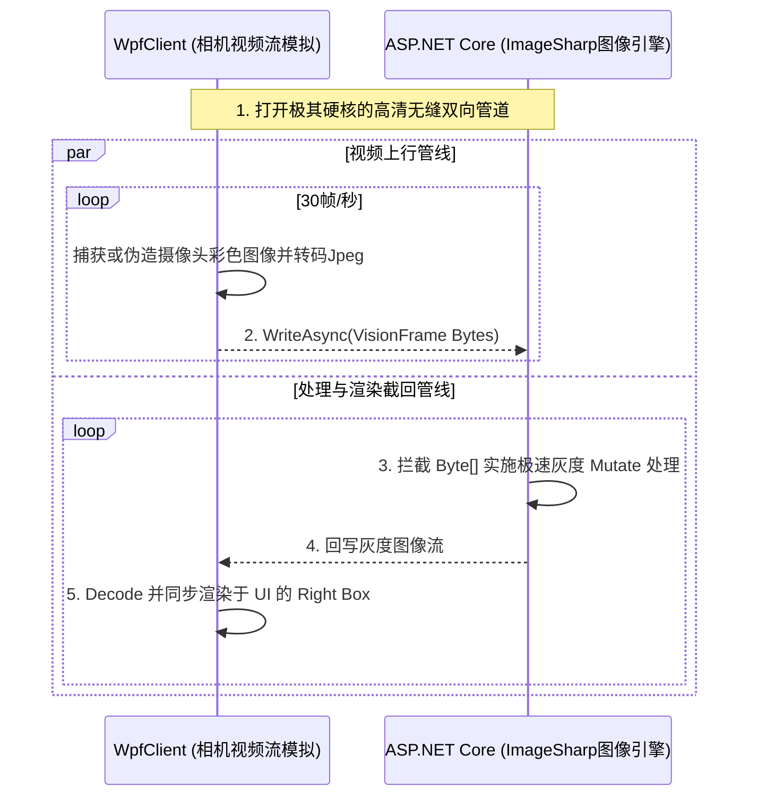

# 工业级前后端彻底分离架构演示 (gRPC + SignalR + Vue3 + WPF)

本系统旨在展示一种**高性能、跨平台、前后端彻底解耦**的工业级上位机（或工控看板）通信架构参考模型。包含 .NET WPF 本地重型客户端与 Vue 3 Web 轻数据大屏。

---

## 📁 一、 项目代码结构

本项目由四个核心工程组成，构成完整的微服务与强类型契约体系：

- **`Industrial.Shared` (共享类库)**: 存放核心的 `.proto` (Protobuf) 契约文件。负责定义 gRPC 的请求/响应数据结构，是跨语言和跨工程双向沟通的唯一权威桥梁。
- **`Industrial.Server` (ASP.NET Core Server)**: 核心主控服务端。承载了所有的 gRPC 服务 (`DeviceControlService`)、SignalR 集线器 (`DeviceStatusHub`)、后台长连接仿真数据服务 (`DataSimulationWorker`) 以及提供外部拉取的 HTTP API。
- **`Industrial.WpfClient` (.NET 8 WPF)**: 本地重型客户端。使用 OxyPlot 绘制高频图表，通过 gRPC 的四种核心模式（一元调用、客户端流、服务端流、双向流）直接操控底层的硬件级通讯。
- **`Industrial.Vue` (Vue 3 + Vite)**: 远程 Web 大数据看板。通过 SignalR WebSocket 接收服务端下发的海量毫秒级模拟机床数据流并利用 ECharts 生成实时动画图表。

---

## 🚀 二、 如何使用命令行启动每个项目以及启动后操作

推荐使用终端命令行 (CLI) 启动每一个独立微服务。请打开三个单独的 Terminal 工具。

### 1. 启动主干服务端 (Server)
进入项目根目录的终端，执行：
```bash
cd src/Industrial.Server
dotnet run
```
*启动成功后监听在 `https://localhost:7212`。此常驻进程必须保持运行，它是整个系统的数据心脏。*

### 2. 启动 WPF 工业操作台 (WpfClient)
在第二个终端中，执行：
```bash
cd src/Industrial.WpfClient
dotnet run
```
**操作指南**：
1. 界面开启后，优先点击右上角的 **`Connect`** 以接通全局 gRPC 底层通道。
2. 在 `Vibration Monitoring` 页签点击 **`Server Stream (Data)`**，欣赏源源不断的工业级毫秒震动曲线推送渲染。
3. 在 `Trajectory & SVG Mapping` 页签点击 **`Download SVG Path`**，由后端通过矩阵变换剥离打碎 Svg 为极密坐标流向客户端传输并引发全屏绘制。
4. 在 `Machine Vision & AI` 页签点击 **`Start Real-time Vision (Bidi Stream)`**，你将看到一个由 WPF 本地生成的假想“机械臂视觉侦测框”连续画面。以高达 30 帧的速率不断通过 gRPC 上传至服务端；服务端利用 `SixLabors.ImageSharp` 引擎进行工业级灰度转化和噪点过滤后，即时双向流式回传给 WPF 并在右侧屏幕渲染！
5. 在最右侧面板的底部，点击 **`Bidi Stream`** 体验全双工遥控操作同步：左发请求、右接状态。

### 3. 启动 Vue Web 可视化大屏 (Vue UI)
在第三个包含 Node.js 环境的终端中，执行：
```bash
cd src/Industrial.Vue
npm install
npm run dev
```
**操作指南**：
1. 浏览器打开界面 `http://localhost:5173`。
2. 点击左上角的 **`[打开链接]`** 发起对后端 SignalR 长连接的握手请求。
3. 连接成功后，右侧面板将开始涌入系统日志追踪事件。左侧每 3s/4s 极速刷入机床状态参数、温度预警大屏曲线图表开始绘制。
4. 通过右侧操作面板可以向下位机的服务端发送“下发指令”。点击 **`⟳ 手动拉取实时机床温度`** 按钮来插队发起一次独立的 WebAPI HTTP 拉取指令。

---

## ⚙️ 三、 代码原理和项目架构原理解析

本架构彻底抛弃了单纯的传统 REST 轮询方案，采用**高低频分离的双信道传输**。

### 1. 宏观项目混合架构模式



---

### 2. 操作对应服务的原理详解

底层核心依赖由于采用了 `.proto` 强规范与多通道设计，使得上层能衍生出下面五大典型工业控制绝招：

#### 🔘 一元调用 (Unary RPC) —— 对应: `Send START Command` 按钮
发送明确控制指令。头部压缩和去泛型化解析速度远超普通 JSON HTTP。


#### 🔘 服务端流式推送 (Server Streaming) —— 对应: `Server Stream` / `Download SVG` 按钮
应对上万级别的历史数组拉取、曲线下行方案，避免了巨大的超时压力。流式读取可以在完整内容全送达前就一边接收一边通知 UI 动画渲染。如果客户端掉线，服务器流立即感应熔断终止浪费。



#### 🔘 客户端流式推送 (Client Streaming) —— 对应: `Client Stream` 按钮
主要用于大文件、庞大 CAD 轨迹组传输给下位机，避免把系统内存撑爆。


#### 🔘 双向独立流 (Bidi Streaming) —— 对应: `Bidi Stream` 按钮
在同一个物理连接信道内，读写彻底解耦实现异步“对冲通讯”。一方模拟人类操纵摇杆，一方反馈下发机器真实现状转速，用于低延迟遥操作。


#### 🔘 WebSockets 全域双工广播 (SignalR + Vue) —— 对应: `打开链接` / `手动拉取温度` 按钮
由 Vue 渲染器无缝衔接 C# 的守护工作线程，当发生任何改变，远端直接操纵网页内 DOM，而非被动等待刷新导致真空期。



#### 🔘 双向流机器视觉与AI极速处理 (Live Machine Vision) —— 对应 `Start Real-time Vision` 按钮
这个特性展示了针对真正的“工业相机”所带来的吞吐量压力。WPF 每秒生成 30 张高分辨率静态帧，通过 `ByteString` 直接拍进双向流。远端 ASP.NET 承接后不落地，使用 ImageSharp 在内存中完成工业级图像灰度萃取并立刻压回 Jpeg 返回。

