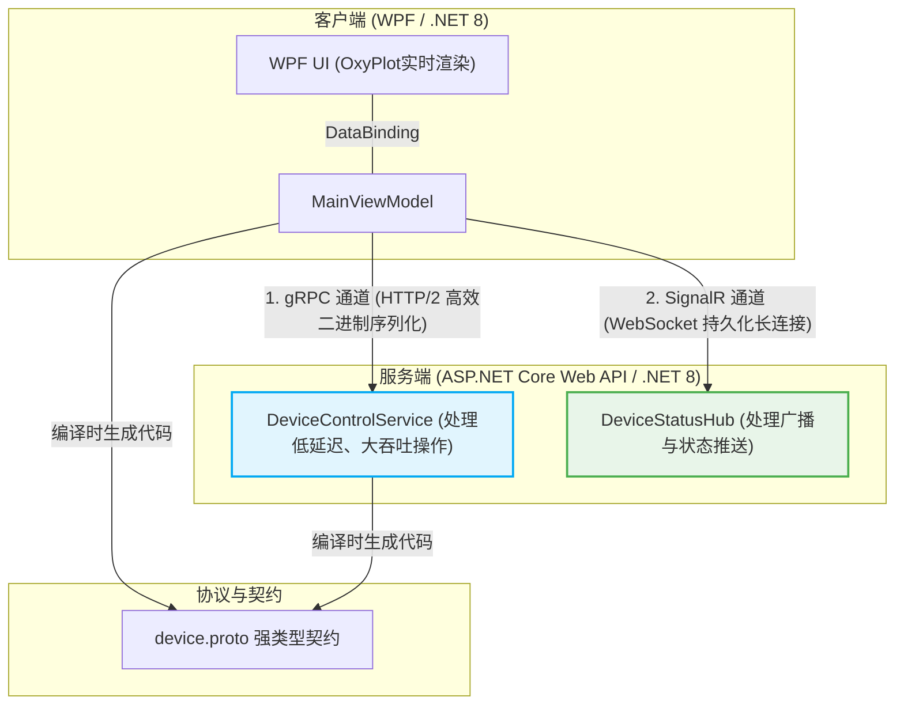
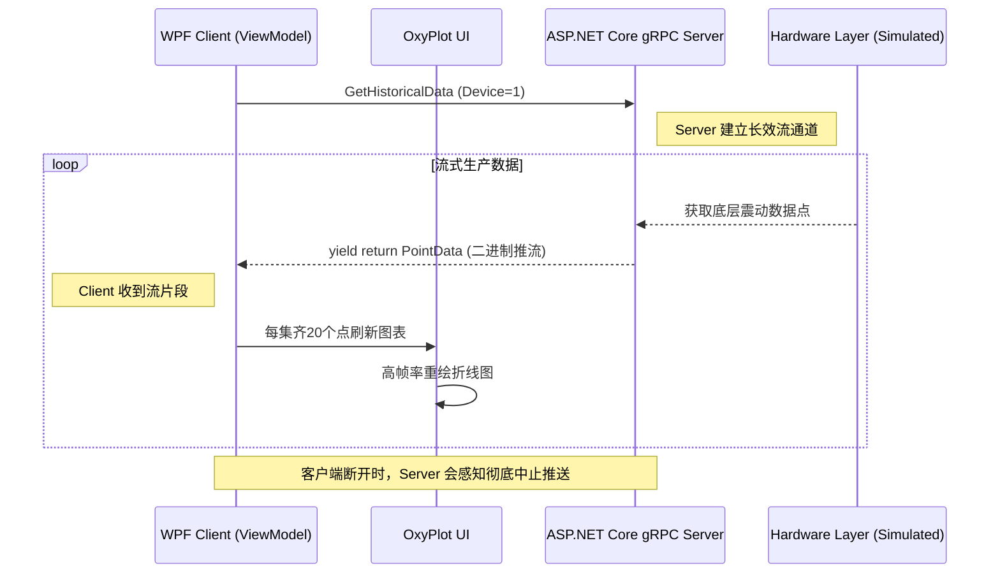

# 工业级前后端彻底分离架构演示 (gRPC + SignalR)

本系统旨在展示一种**高性能、前后端彻底解耦**的工业级上位机（或工控看板）通信架构参考模型。通过结合 gRPC 和 SignalR，解决传统 RESTful API 在工业场景下的性能瓶颈和双向通信难题。

## 🎯 核心设计目标与痛点解决

在传统的工业软件开发中，经常面临以下痛点：
1. **契约不一致**：前后端语言差异导致数据结构（DTO）经常对不上号，需要大量人工对比和调试。
2. **海量数据吞吐瓶颈**：需要处理持续、高频且极大量的数据流（如数百 Hz 的传感器采样信号），常规 RESTful API (HTTP 1.1 + JSON) 因庞大的头部冗余和文本解析性能瓶颈而导致卡顿甚至内存溢出。
3. **状态主动感知难**：需要服务端主动推送报警（如底层 PLC 报错、硬件断线等），如果依赖客户端定时轮询，不仅会有延迟，还会造成巨大的网络与服务器资源浪费。

### 架构原理与解决策略

为了彻底解决上述痛点，本项目采用了**混合双通道通信架构**。



---

## ⚙️ 代码运行原理与核心机制详解

本架构将通信严格划分为两大职责域：**指令与数据获取 (gRPC)** 和 **状态与预警推送 (SignalR)**。

### 1. 契约优先 (Contract First) 的代码生成
* **原理**：不使用 C# 实体类作为通信结构，而是使用独立类库 `Industrial.Shared` 中的 `device.proto`。
* **执行过程**：项目在编译时，MSBuild 会调用 `Grpc.Tools` 编译器，读取 `.proto` 文件，并在幕后分别为 Server 生成服务基类，为 WpfClient 生成客户端调用代理类。这保证了无论在服务端怎么修改字段，另一端如果没更新就会在**编译期报错**，彻底杜绝运行期才发现字段不匹配的问题。

### 2. gRPC 一元调用 (Unary RPC) —— 执行指令
* **场景**：点击 "Send START Command" 按钮。
* **原理**：发送明确的控制指令，要求立刻返回成功或失败状态。gRPC 基于 HTTP/2 协议复用 TCP 连接，并且将参数打包为紧凑的 Protobuf 二进制格式。其头部压缩和去文本化使得解析速度远超普通 JSON HTTP 请求。

### 3. gRPC 服务端流式推送 (Server Streaming RPC) —— 毫秒级数据看板
这是工业级看板最依赖的杀手锏功能。



* **执行过程** (`MainViewModel.StartStreamingDataAsync`)：
    1. WPF 客户端向 Server 发起数据流请求。
    2. Server 端 (`DeviceControlService`) 利用 `IServerStreamWriter<PointData>` 开辟一条虚拟管道。
    3. Server 端在一个 `For` 循环中以极高频率（每 5ms）生成或捕获底层硬件数据，并通过管道 **`await responseStream.WriteAsync()`** 异步推送给客户端。这避免了服务端将 5000 个点塞满内存再发送的窘境。
    4. WPF 客户端通过 `await foreach` 接收这个无穷无尽的流。为了保持界面 60FPS 的丝滑且不阻塞 UI 线程，设定了一个阈值（如每接收 20 个点），通知 OxyPlot 更新一帧曲线，完成如同示波器般的实时渲染。

* **场景 1（振动监测）**：点击 "Server Stream (Data)" 按钮。
* **原理 1**：WPF 客户端向服务端请求历史高频数据。真实机床的 1000Hz 震动点如果用传统 HTTP 返回，可能要产生一个数十 MB 的 JSON 数据包，前端接收到后解析极度卡顿。而利用服务端流 `IAsyncStreamReader<PointData>`，服务端一边查库/或读取传感器，一边利用 `await responseStream.WriteAsync()` 像水管流水一样**源源不断、低内存占用**地下发。客户端则能在未接收完所有数据前，就开始动态刷新图表。
* **场景 2（硬核 SVG 矢量剥离与插值下发）**：在左侧选项卡中切换到 "Trajectory & SVG Mapping"，点击 "Download SVG Path (Server Stream)" 按钮。
* **原理 2**：这是真正对标高端工业数控驱动的极佳演示。服务端摒弃了死板的手写折线，而是直接引入了标准版 `Svg` 解析库以及 `System.Drawing.Drawing2D.Matrix` 仿射变换矩阵引擎。
  * **高精度微积分插值**：服务端通过解析极其复杂的纯 `<path d="...">` 语法，当遭遇三阶/二阶贝塞尔曲线（`C`, `Q`）乃至其相对路径变体（`c`, `q`）时，在后台以20次/曲线的精度实时插值运算出平滑差值点。
  * **仿射重塑**：如果你的矢量原图（如带有邪笑和倾斜眉毛的滑稽脸 `doge3.svg`）包含旋转缩放等 `transform` 特征，服务端通过矩阵变换引擎能瞬间在内存中扭转地球坐标。
  * **流式绘制**：一切运算完成的离散坐标化作细粒度的 `stream PointData` 借由 gRPC 高速下行给 WPF。当需要跨区段位移时，巧妙发送信标（如 `Double.NaN`），使前端 `OxyPlot` 在呈现完美机床运动轨迹时实现“无缝抬刀跳跃”，极致顺滑。

**解决策略**
将轮询或庞大的大页状加载，重构为 gRPC Server Streaming。（见上方实现）。

### 4. gRPC 客户端流式推送 (Client Streaming RPC) —— 海量轨迹下发
* **场景**：点击 "Client Stream (Upload)" 按钮。
* **原理**：当上位机解析完 CAD 图纸，需要将几十万个加工轨迹点发送给下位机时，如果打包成一个超大 JSON 请求，会导致严重的内存暴增和网络超时风险。通过 gRPC 的客户端流，上位机可以发起一条连接，然后以流片段的形式 `await requestStream.WriteAsync()` 分批次疯狂注入数据。服务端则通过 `await foreach` 接收。当全部传完后，服务端统一返回一个确认结果。

**解决策略**
将上报操作切换为 gRPC Client Streaming（见上方实现）。在工业中通常使用 MQTT 进行大数据包上行或边缘存储后批量回传。

---

#### 3. SignalR：反向主动推送与控制通道
针对需要从设备或边缘端向上位机（甚至云端）主动发送简单心跳或状态报告的情况，SignalR 也可以作为强类型的 Client-to-Server 链路：
**底层原理解析：**
由于 SignalR `HubConnection` 会在 C# 内维持一条底层的持久化连接（常见为 WebSocket），因此不仅可以用来“被动听告警”，客户端也能直接在此连接上使用 `InvokeAsync(MethodName, Args)` 直接将简单文本或数据推流进服务端内存，而且不会像传统 HTTP 接口那样经历 TCP 三次握手的开销。

**此 Demo 中的体验：**
*   点击 **"Push Log to Server (SignalR)"**，WPF 会拼装好当前时间直接推入后端。
*   此数据**只会在 Server 端的控制台以紫红色高亮输出打印**，不仅演示了客户端向服务端轻量发消息的能力，也展示了我们对消息路由走向可以做到完全掌控（即服务器收到后可以选择不再滥发给同一组的其他人）。

---
### 5. gRPC 双向流式推送 (Bidirectional Streaming RPC) —— 实时硬核遥操作
* **场景**：点击 "Bidi Stream (Live)" 按钮。
* **原理**：这是 gRPC 最强大的特性。它允许在**同一个 HTTP/2 TCP 连接下，客户端和服务端互相独立、并发地发送消息流**。在这个 Demo 中，客户端在一个并发任务中模拟工人手动打摇杆（下发 `TeleoperationCmd`），同时服务端在另一个并发任务中模拟电机当前的编码器反馈（回传 `TeleoperationFeed`）。这是一条真正的实时“通信高速公路”，对于需要极速感官反馈的操作（如远程医疗机器人、机械臂操控）至关重要。

### 6. SignalR 全双工状态广播 —— 被动预警与跨端推送
* **场景**：点击 "Simulate Remote Alarm" 按钮。
* **原理**：在 `MainViewModel` 构建的 `HubConnection` 默认使用 WebSockets 建立长连接。在我们的 Demo 中，当你点击模拟预警按钮，WPF 其实是通过普通 HTTP POST 调用了后端的一个 Web API `api/alarm/trigger`。后端 API 收到后，利用 `IHubContext` 向所有连接着的 SignalR 客户端广播了 `ReceiveTemperatureWarning` 事件！这正是工业看板中最实用的架构：无论底层 PLC 故障触发了哪个微服务，只要向集线器发一条消息，全车间所有墙上的大屏和手持终端都会在一瞬间弹出警报。
* **容错原理**：配置了 `.WithAutomaticReconnect()` 策略。如果工厂网络瞬间波动导致 Socket 断开，SignalR 将按斐波那契数列退避算法（0s, 2s, 10s, 30s）在后台不断重试恢复连接，连接期间丢失的状态也不会引起客户端崩溃。

---

## 🔑 本地开发的特殊机制：HTTP/2 与 HTTPS(SSL) 穿透

很多开发者在本地尝试 gRPC 时会被证书错误劝退。这是因为 **gRPC 在 .NET 平台强依赖于 HTTP/2**，而为了建立稳定的 HTTP/2 通道（ALPN 协商），强制要求使用 HTTPS 端点（例如 `https://localhost:7212`）。

为了既能享受完整性能又不被本地 SSL 证书困扰，我们在代码中进行了**证书绕过处理**：

```csharp
// 在 MainViewModel.cs 中：
var handler = new System.Net.Http.HttpClientHandler();
// 危险操作声明：信任该主机提供的任何（包括自签名或不受信任）的安全证书
handler.ServerCertificateCustomValidationCallback = 
    System.Net.Http.HttpClientHandler.DangerousAcceptAnyServerCertificateValidator;
```
> ⚠️ 注意：这允许在任意缺省证书环境（如未运行 `dotnet dev-certs https --trust` 的机器）丝滑编译运行。但在真实的工厂内网或云端部署时，强烈建议配置真实的 CA 根证书以保证链路安全。

---

## 🚀 如何运行本项目

1. 使用 Visual Studio 2022 打开解决方案 `IndustrialDemo.sln`。
2. 确保将服务端 `Industrial.Server` 设置为**启动项目**之一，并在启动按钮旁的下拉框中，将运行配置从默认的 `IIS Express` 切换为项目自身的名称 **`https`**（重要！IIS Express 会降级协议）。
3. 使用 `Ctrl + F5` 启动服务端微服务，等待控制台出现 `Now listening on: https://localhost:7212`。
4. 将 `Industrial.WpfClient` 设为启动项目并运行。
5. 在左侧全新的 **TabControl 高清大屏** 中体验：
   - 切换到 **`Vibration Monitoring (Server Stream)`** 选项卡，感受真正的不堵塞长连接推流式实时工业波形图。
   - 切换到 **`Trajectory & SVG Mapping`** 选项卡，一键体验海量轨迹客户端上行；点击 **`Download SVG Path`** 体验源自三阶贝塞尔+仿射变换矩阵的高密度算法推流，见证全屏动态滑稽笑脸绘图。
6. 右侧常驻的**控制与通信中岛**，使用 **`Bidi Stream (Live Teleop)`** 测试全双工实时同步摇杆操作反馈，使用 **`Push Log to Server`** (SignalR) 测试客户端直连服务端的轻量上抛报警与状态报告体系。
