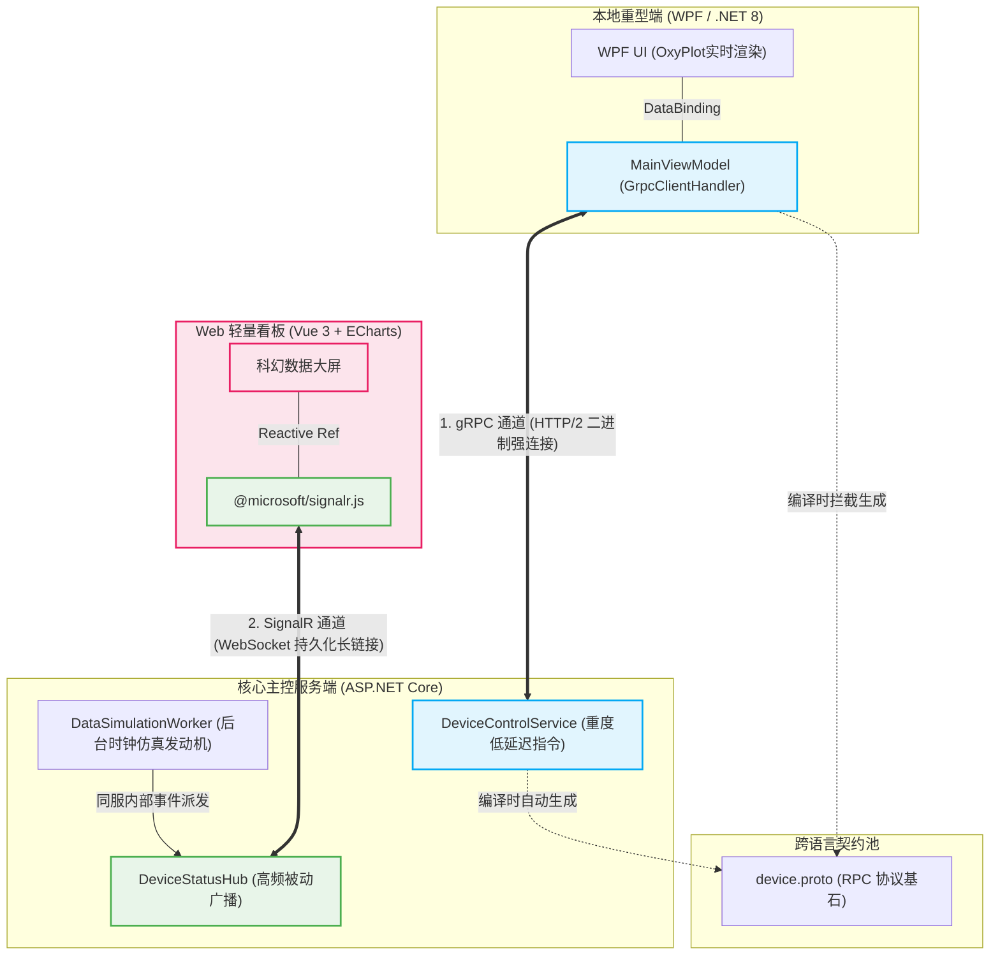
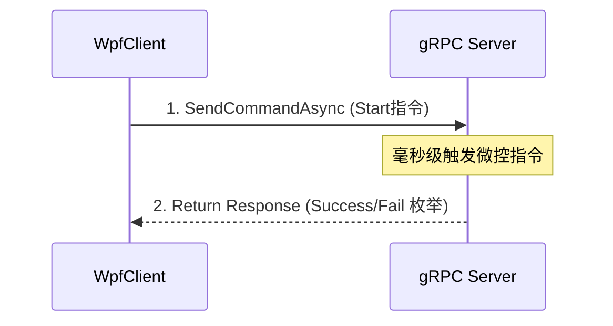
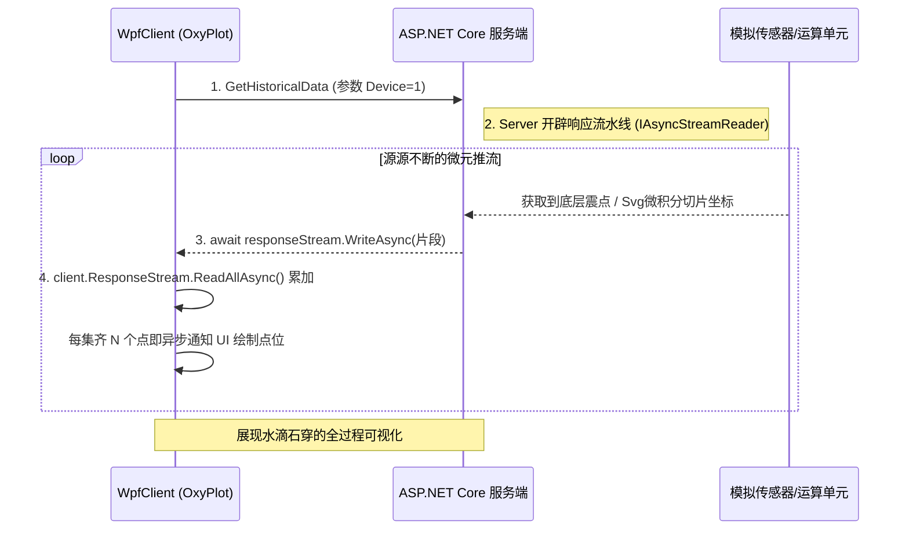
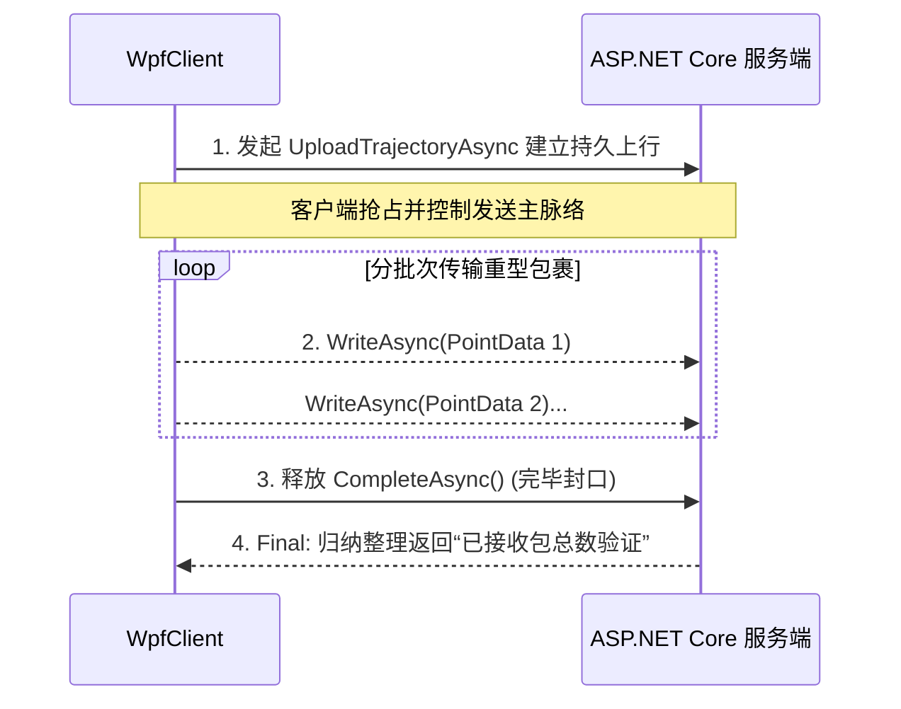
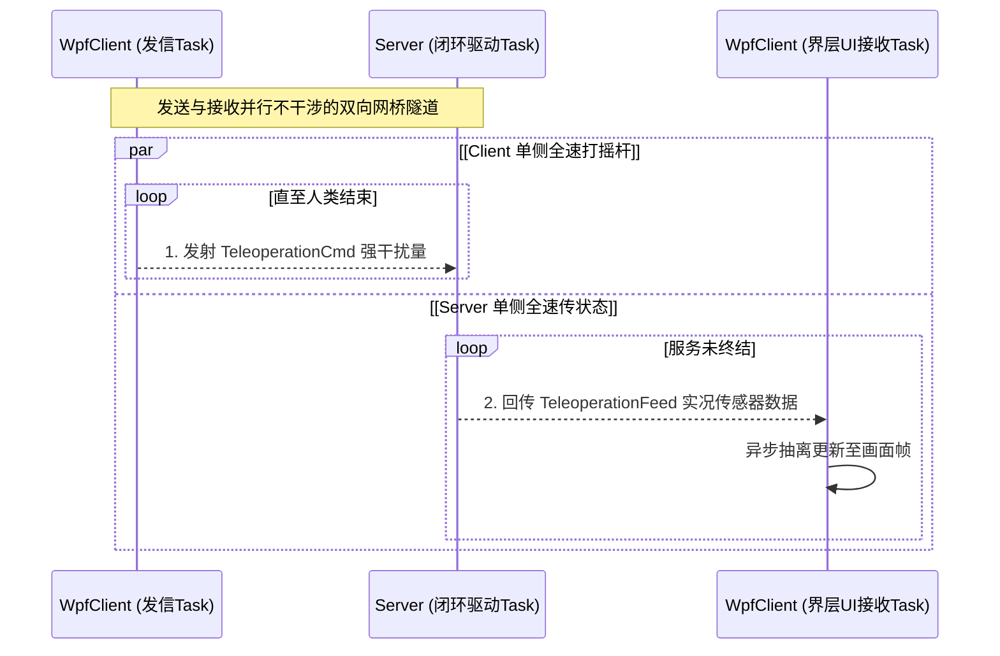
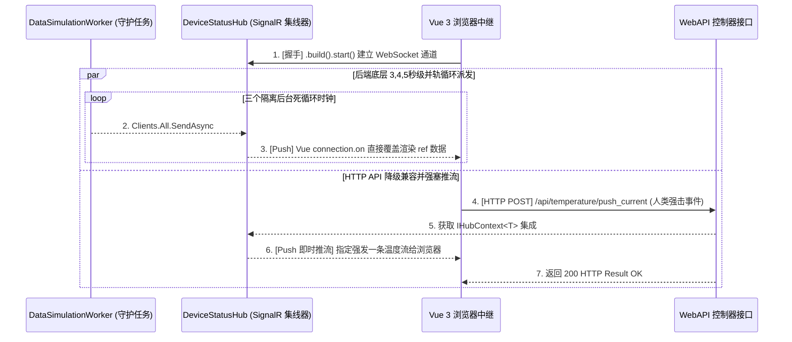
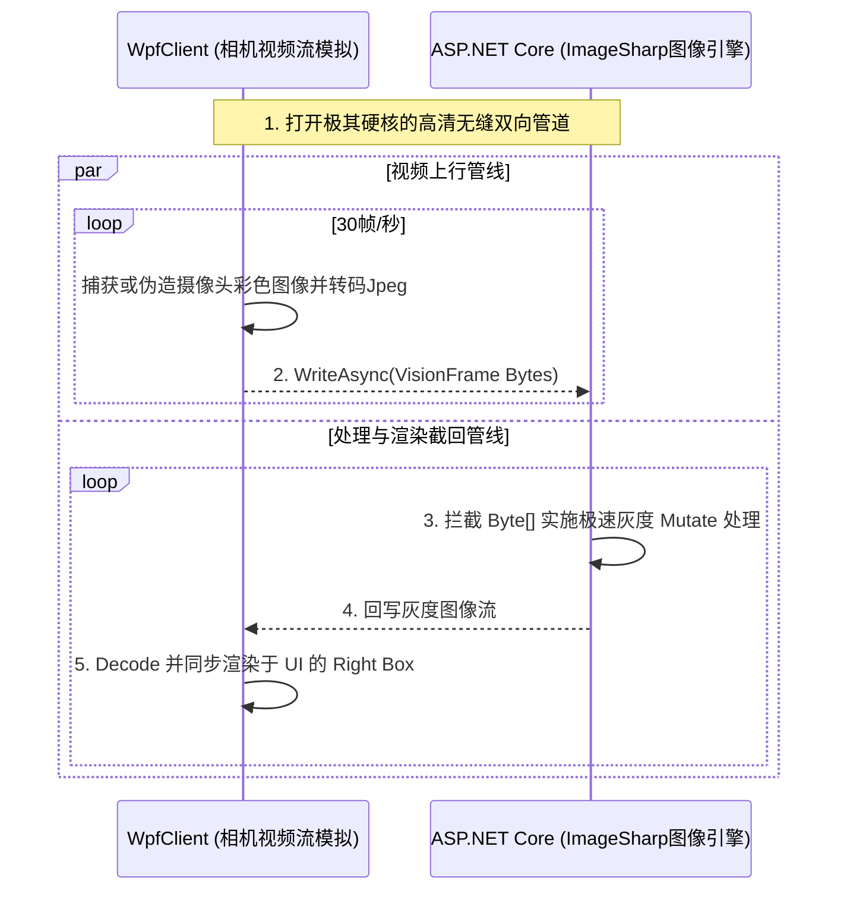

# 工业级前后端彻底分离架构演示 (gRPC + SignalR + Vue3 + WPF)

本系统旨在展示一种**高性能、跨平台、前后端彻底解耦**的工业级上位机（或工控看板）通信架构参考模型。包含 .NET WPF 本地重型客户端与 Vue 3 Web 轻数据大屏。

---

## 📁 一、 项目代码结构

本项目由四个核心工程组成，构成完整的微服务与强类型契约体系：

- **`Industrial.Shared` (共享类库)**: 存放核心的 `.proto` (Protobuf) 契约文件。负责定义 gRPC 的请求/响应数据结构，是跨语言和跨工程双向沟通的唯一权威桥梁。
- **`Industrial.Server` (ASP.NET Core Server)**: 核心主控服务端。承载了所有的 gRPC 服务 (`DeviceControlService`)、SignalR 集线器 (`DeviceStatusHub`)、后台长连接仿真数据服务 (`DataSimulationWorker`) 以及提供外部拉取的 HTTP API。
- **`Industrial.WpfClient` (.NET 8 WPF)**: 本地重型客户端。使用 OxyPlot 绘制高频图表，通过 gRPC 的四种核心模式（一元调用、客户端流、服务端流、双向流）直接操控底层的硬件级通讯。
- **`Industrial.Vue` (Vue 3 + Vite)**: 远程 Web 大数据看板。通过 SignalR WebSocket 接收服务端下发的海量毫秒级模拟机床数据流并利用 ECharts 生成实时动画图表。

---

## 🚀 二、 如何启动项目及启动后操作

针对不同的使用场景，提供了一键自动化启动和分步手动启动两种方案。

### 📌 方式一：使用便捷脚本一键启动（推荐桌面用户）

在代码的 `src` 目录下准备了可无痛体验整个运行生态的启动脚本。它会自动隐藏黑框并在浏览器中直接打开就绪状态的大屏。

1. **一键启动所有（服务器 + WPF + Web 界面）**
   您可以直接双击运行 **`src\StartAll.bat`**。
   - `StartServer.bat`: 启动 ASP.NET Core 服务端（监听 https://localhost:7212）
   - `StartWPF.bat`: 以后台无控制台模式（WindowStyle Hidden）启动 WPF 前端，不会出现多余黑框。
   - `StartVue.bat`: 启动 Vite 本地服务器（端口定为 5175），成功后自动通过浏览器打开页面。

如果您只需启动特定部件或者分别调试，也可以在 `src` 下双击对应的单一 `*.bat`。

---

### 📌 方式二：手动多终端隔离启动（推荐开发/调试）

如果您希望看完整的生命周期日志，推荐使用终端命令行 (CLI) 启动每一个独立微服务。请打开三个单独的 Terminal 工具。

#### 1. 启动主干服务端 (Server)
进入项目根目录的终端，执行：
```bash
cd src/Industrial.Server
dotnet run --launch-profile https
```
*启动成功后监听在 `https://localhost:7212`。此常驻进程必须保持运行，它是整个系统的数据心脏。*

#### 2. 启动 WPF 工业操作台 (WpfClient)
在第二个终端中，执行：
```bash
cd src/Industrial.WpfClient
dotnet run
```
**操作指南**：
1. 界面开启后，优先点击右上角的 **`Connect`** 以接通全局 gRPC 底层通道。
2. 在 `Vibration Monitoring` 页签点击 **`Server Stream (Data)`**，欣赏源源不断的工业级毫秒震动曲线推送渲染。
3. 在 `Trajectory & SVG Mapping` 页签点击 **`Download SVG Path`**，由后端通过矩阵变换剥离打碎 Svg 为极密坐标流向客户端传输并引发全屏绘制。
4. 在 `Machine Vision & AI` 页签点击 **`Start Real-time Vision (Bidi Stream)`**，你将看到一个由 WPF 本地生成的假想“机械臂视觉侦测框”连续画面。以高达 30 帧的速率不断通过 gRPC 上传至服务端；服务端利用 `SixLabors.ImageSharp` 引擎进行工业级灰度转化和噪点过滤后，即时双向流式回传给 WPF 并在右侧屏幕渲染！
5. 在最右侧面板的底部，点击 **`Bidi Stream`** 体验全双工遥控操作同步：左发请求、右接状态。

#### 3. 启动 Vue Web 可视化大屏 (Vue UI)
在第三个包含 Node.js 环境的终端中，执行：
```bash
cd src/Industrial.Vue
npm install
npm run dev -- --port 5175 --open
```
**操作指南**：
1. 浏览器会弹出一个页面 `http://localhost:5175`。
2. 点击左上角的 **`[打开链接]`** 发起对后端 SignalR 长连接的握手请求。
3. 连接成功后，右侧面板将开始涌入系统日志追踪事件。左侧每 3s/4s 极速刷入机床状态参数、温度预警大屏曲线图表开始绘制。
4. 通过右侧操作面板可以向下位机的服务端发送“下发指令”。点击 **`⟳ 手动拉取实时机床温度`** 按钮来插队发起一次独立的 WebAPI HTTP 拉取指令。

---

## ⚙️ 三、 代码原理和项目架构原理解析

本架构彻底抛弃了单纯的传统 REST 轮询方案，采用**高低频分离的双信道传输**。

### 1. 宏观项目混合架构模式



---

### 2. 操作对应服务的原理详解

底层核心依赖由于采用了 `.proto` 强规范与多通道设计，使得上层能衍生出下面五大典型工业控制绝招：

#### 🔘 一元调用 (Unary RPC) —— 对应: `Send START Command` 按钮
发送明确控制指令。头部压缩和去泛型化解析速度远超普通 JSON HTTP。


#### 🔘 服务端流式推送 (Server Streaming) —— 对应: `Server Stream` / `Download SVG` 按钮
应对上万级别的历史数组拉取、曲线下行方案，避免了巨大的超时压力。流式读取可以在完整内容全送达前就一边接收一边通知 UI 动画渲染。如果客户端掉线，服务器流立即感应熔断终止浪费。



#### 🔘 客户端流式推送 (Client Streaming) —— 对应: `Client Stream` 按钮
主要用于大文件、庞大 CAD 轨迹组传输给下位机，避免把系统内存撑爆。


#### 🔘 双向独立流 (Bidi Streaming) —— 对应: `Bidi Stream` 按钮
在同一个物理连接信道内，读写彻底解耦实现异步“对冲通讯”。一方模拟人类操纵摇杆，一方反馈下发机器真实现状转速，用于低延迟遥操作。


#### 🔘 WebSockets 全域双工广播 (SignalR + Vue) —— 对应: `打开链接` / `手动拉取温度` 按钮
由 Vue 渲染器无缝衔接 C# 的守护工作线程，当发生任何改变，远端直接操纵网页内 DOM，而非被动等待刷新导致真空期。



#### 🔘 双向流机器视觉与AI极速处理 (Live Machine Vision) —— 对应 `Start Real-time Vision` 按钮
这个特性展示了针对真正的“工业相机”所带来的吞吐量压力。WPF 每秒生成 30 张高分辨率静态帧，通过 `ByteString` 直接拍进双向流。远端 ASP.NET 承接后不落地，使用 ImageSharp 在内存中完成工业级图像灰度萃取并立刻压回 Jpeg 返回。


---

## 🔥 四、 Native AOT 发布指南

本节记录将 `Industrial.Server` 发布为**原生 AOT（Ahead-Of-Time）** 独立执行文件时，所有必须处理的适配要点及原理。AOT 可以带来极速启动（毫秒级）、极低内存占用和无需目标机器安装 .NET Runtime 的优势，但也引入了严格的静态分析限制。

### 📌 1. 项目文件配置 (`Industrial.Server.csproj`)

在 `.csproj` 中启用 AOT 发布，并设置发布目录：

```xml
<PropertyGroup>
  <TargetFramework>net8.0</TargetFramework>
  <Nullable>enable</Nullable>
  <ImplicitUsings>enable</ImplicitUsings>
  <!-- 启用原生 AOT -->
  <PublishAot>true</PublishAot>
  <!-- 发布到解决方案 publish/Server 目录 -->
  <PublishDir>..\..\publish\Server\</PublishDir>
</PropertyGroup>
```

> **`PublishAot=true` 隐含了 `PublishTrimmed=true`。** AOT 会对所有未被静态引用的代码进行裁剪（Trimming），这是 AOT 运行时体积和性能优势的来源，也是所有适配问题的根本原因。

**发布命令：**
```bash
# 发布（csproj 中已配置 PublishDir，无需额外指定路径）
dotnet publish src\Industrial.Server\Industrial.Server.csproj -c Release
```

**前提条件：** Windows 上进行 AOT 发布必须安装 **Visual Studio 的"使用 C++ 的桌面开发"工作负载**（包含 MSVC 工具链）。

---

### 📌 2. 通过 PublishProfile 发布 (`.pubxml`)

在 `Properties/PublishProfiles/FolderProfile.pubxml` 中，**必须同时声明** `<PublishAot>true</PublishAot>`，否则 Visual Studio 的"发布"按钮不会走 AOT 流程：

```xml
<PropertyGroup>
  <PublishTrimmed>true</PublishTrimmed>
  <PublishAot>true</PublishAot>
  <RuntimeIdentifier>win-x64</RuntimeIdentifier>
  <SelfContained>true</SelfContained>
</PropertyGroup>
```

---

### 📌 3. 端口配置：Kestrel 需要在代码中显式声明

AOT 下运行时对反射能力的裁剪导致仅依赖 `appsettings.json` 的 Kestrel 端口绑定在某些场景下无法生效。推荐**直接在 `Program.cs` 代码中**通过 `ConfigureKestrel` 显式配置：

```csharp
builder.WebHost.ConfigureKestrel(options =>
{
    // HTTPS 端口 (需要 dev-cert 或正式证书)
    options.ListenLocalhost(7212, o => o.UseHttps());
    // HTTP 端口
    options.ListenLocalhost(5268);
});
```

**HTTPS dev-cert 首次生成与信任：**
```bash
dotnet dev-certs https --trust
```

> 如果目标机器是服务器生产环境，应将 `UseHttps()` 换为加载真实 PFX/PEM 证书；或直接只暴露 HTTP 端口并在后面加 Nginx/反代负责 TLS。

---

### 📌 4. SignalR 强类型 Hub 不兼容 AOT

**问题根因：** `Hub<IDeviceStatusClient>` 的强类型客户端代理，在运行时需要 `System.Reflection.Emit` 动态生成实现了 `IDeviceStatusClient` 接口的代理类。AOT 下动态代码生成被完全禁止，导致抛出：
```
System.PlatformNotSupportedException: Dynamic code generation is not supported on this platform.
```

**解决方案：退回弱类型 Hub，用 `SendAsync` 替代强类型方法调用：**

```csharp
// ❌ AOT 不兼容：强类型 Hub
public class DeviceStatusHub : Hub<IDeviceStatusClient> { }

// ✅ AOT 兼容：弱类型 Hub
public class DeviceStatusHub : Hub { }
```

所有注入和调用同步替换：

```csharp
// ❌ 不兼容
private readonly IHubContext<DeviceStatusHub, IDeviceStatusClient> _hubContext;
await _hubContext.Clients.Group("x").UpdateMachineState(code, desc);

// ✅ 兼容
private readonly IHubContext<DeviceStatusHub> _hubContext;
await _hubContext.Clients.Group("x").SendAsync("UpdateMachineState", code, desc);
```

---

### 📌 5. SignalR JSON 序列化失败

**问题根因：** AOT 下 `System.Text.Json` 的反射序列化被禁用。SignalR 的 `JsonHubProtocol` 在向客户端发送消息时会尝试用反射序列化参数，从而抛出：
```
System.InvalidOperationException: Reflection-based serialization has been disabled for this application.
```

**解决方案：** 通过 `AddJsonProtocol` 显式配置 `DefaultJsonTypeInfoResolver`，它能处理基础类型（`string`、`double`、`int`）的序列化而不依赖运行时反射：

```csharp
builder.Services.AddSignalR()
    .AddJsonProtocol(options =>
    {
        options.PayloadSerializerOptions.TypeInfoResolver =
            new System.Text.Json.Serialization.Metadata.DefaultJsonTypeInfoResolver();
    });
```

> **适用范围：** SignalR `SendAsync` 传递的参数为基础类型或简单值类型时，此方案完全可行。若需传递复杂自定义对象，则需进入下一条的 Source Generator 方案。

---

### 📌 6. Minimal API 返回自定义对象：JSON Source Generator

**问题根因：** AOT 编译阶段，Minimal API 的 Source Generator 会扫描所有路由处理函数的返回类型并预生成 JSON 序列化代码。**匿名类型**（`new { message = "..." }`）以及**未注册的具名类型**都无法被静态分析追踪，运行时抛出：
```
System.NotSupportedException: JsonTypeInfo metadata for type 'XXX' was not provided.
```

**最佳解决方案：声明 `JsonSerializerContext` 并注册到 HTTP 选项链：**

```csharp
// 1. ❌ 不兼容：匿名类型
return Results.Ok(new { message = "ok" });

// 2. ✅ 兼容：声明具名 record + JsonSerializerContext
internal record PushResult(string Message);

[JsonSerializable(typeof(PushResult))]
internal partial class AppJsonContext : JsonSerializerContext { }

// 3. ✅ 在 Program.cs 中注册到 HTTP 选项
builder.Services.ConfigureHttpJsonOptions(o =>
    o.SerializerOptions.TypeInfoResolverChain.Insert(0, AppJsonContext.Default));

// 4. ✅ 正常返回
return Results.Ok(new PushResult("Current temperature pushed"));
```

> **重要：** C# 顶级语句（Top-level statements）文件（`Program.cs`）中，类型声明（`record`、`class`）**必须放在文件末尾**，即所有顶级语句之后。否则编译器报 `顶级语句必须位于命名空间和类型声明之前`。

---

### 📌 7. 常见 AOT 不兼容场景速查表

| 场景 | 问题根因 | 解决方案 |
|------|---------|---------|
| SignalR 强类型 Hub | 运行时 `Emit` 生成代理类 | 改用弱类型 `Hub`，`SendAsync` 发送 |
| SignalR JSON 序列化 | 反射序列化被禁用 | `AddJsonProtocol` + `DefaultJsonTypeInfoResolver` |
| Minimal API 返回匿名类型 | 匿名类型无法静态分析 | 改用具名 `record` + `[JsonSerializable]` 注册 |
| `AddControllers()` / MVC | MVC 不支持 Trimming | 保留但接受警告，或改用 Minimal API |
| EF Core 懒加载代理 | 运行时 `Emit` | 关闭懒加载，改用显式 `Include()` |
| `JsonSerializer.Deserialize<T>` 泛型 | 反射求类型信息 | 使用 `[JsonSerializable]` Source Generator |
| `Activator.CreateInstance(Type)` | 反射实例化 | 改为直接 `new`，或使用工厂模式 |
| `DynamicProxy` / Castle | 运行时动态类生成 | 使用 Source Generator 替代，或放弃 AOT |
| `Type.GetType(string)` 动态查类型 | 类型可能被裁剪 | 改为直接引用类型，或 `DynamicallyAccessedMembers` 标记 |

---

### 📌 8. 发布产物说明

AOT 发布成功后，`publish/Server/` 目录包含：

| 文件 | 说明 |
|------|------|
| `Industrial.Server.exe` | **唯一可执行文件**，约 30-40 MB，包含所有依赖，无需 .NET Runtime |
| `Industrial.Server.pdb` | 调试符号文件（可删除，不影响运行） |
| `appsettings.json` | 必须随 `.exe` 一起部署 |
| `appsettings.Development.json` | 仅开发环境使用，生产部署可删除 |
| `Assets/` | SVG 等静态资源文件夹（必须随 `.exe` 一起部署） |

> **部署清单（最小化）：** `Industrial.Server.exe` + `appsettings.json` + `Assets/` 目录，三者放在同一目录下即可在任意 Windows x64 机器上运行，**无需安装 .NET**。
